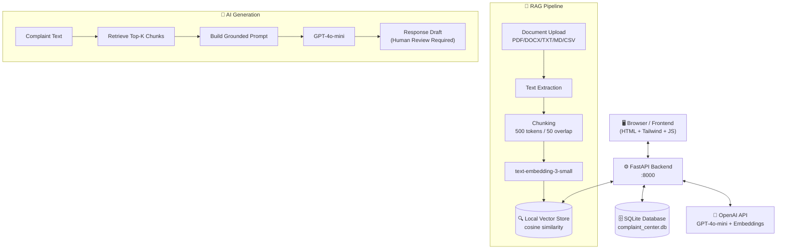

# 🤖 ComplaintIQ — AI Customer Complaint Resolution Center

<div align="center">


**A full-stack AI-powered platform to manage, classify, resolve, and learn from customer complaints — with RAG, multi-channel responses, escalation tracking, and real-time analytics.**

[🚀 Quick Start](#-quick-start-one-command) · [✨ Features](#-features) · [🏗️ Architecture](#%EF%B8%8F-architecture) · [📁 Project Structure](#-project-structure) · [📚 API Docs](#-api-documentation) · [🤝 Contributing](#-contributing)

</div>

---

## 📖 Overview

**ComplaintIQ** transforms how businesses handle customer complaints. Instead of generic template responses, the platform:

- 🧠 **Analyzes** each complaint using AI (sentiment, priority, category, urgency)
- 📄 **Retrieves** relevant context from your own uploaded business documents (RAG)
- ✍️ **Drafts** professional, channel-specific responses grounded in real company policy
- 📊 **Identifies** recurring problems and root causes across your complaint history
- 🔔 **Escalates** high-severity issues automatically with full audit trails

Built for **support agents**, **managers**, and **administrators** — with a premium SaaS-quality UI that works on desktop, tablet, and mobile.

---

## ✨ Features

<table>
<tr>
<td width="50%">

### 🎯 Complaint Management
- Centralized complaint inbox with advanced search & filters
- Auto-classification: category, subcategory, priority, sentiment
- Full lifecycle tracking: New → Under Review → Resolved → Closed
- Status change activity timeline with audit trail

### 🤖 AI Classification & RAG
- GPT-4o-mini powered complaint classification
- RAG pipeline: upload PDFs, DOCX, TXT, MD, CSV
- Cosine similarity vector search (local, no external DB needed)
- Source-grounded responses — AI never invents policies
- 7 response tones: Professional, Empathetic, Formal, Friendly…

### 📊 Analytics & Insights
- Interactive dashboard with 6 KPI cards
- Complaint trend charts (30-day line chart)
- Priority breakdown, department workload, category analysis
- Agent performance tracking & resolution time metrics

</td>
<td width="50%">

### 📚 Knowledge Base
- Drag & drop document upload (PDF, DOCX, TXT, MD, CSV)
- Automatic chunking (500 tokens, 50 overlap) & embedding
- Processing states: Uploaded → Processing → Ready
- Semantic retrieval with source citations in every AI response

### 🔔 Escalation Management
- Auto-detection of escalation triggers (legal, safety, SLA breach)
- Manual escalation with reason, deadline, manager assignment
- Escalation timeline and resolution tracking
- Overdue escalation highlighting

### 📱 Multi-Channel Communication
- Formats for: Email, WhatsApp, SMS, Phone Call, Live Chat, Social Media, Internal Note
- Channel-specific response formatting (call scripts, SMS brevity, social safety)
- Full communication history per complaint
- Human approval required before any response is sent

</td>
</tr>
</table>

---

## 🚀 Quick Start (One Command!)

> No need to open multiple terminals. One command starts everything.

### Prerequisites
- **Python 3.11+** — [Download](https://python.org/downloads)
- **OpenAI API Key** — [Get one](https://platform.openai.com/api-keys)
- **Git** — [Download](https://git-scm.com)

### 1. Clone the repository
```bash
git clone https://github.com/MaryamMumtaz-piaic/ai-customer-complaint-resolution-center.git
cd ai-customer-complaint-resolution-center
```

### 2. Add your OpenAI API Key
```bash
# Copy the example env file
copy backend\.env.example backend\.env
```
Open `backend\.env` and set:
```env
OPENAI_API_KEY=sk-your-openai-api-key-here
```

### 3. Run with ONE command ⚡

**Option A — Python (Recommended, cross-platform):**
```bash
python run.py
```

**Option B — Double-click `start.bat` (Windows):**
```
Just double-click start.bat in File Explorer
```

**Option C — PowerShell:**
```powershell
.\start.ps1
```

✅ That's it! The launcher will:
- Auto-create a virtual environment (first run only)
- Auto-install all backend dependencies (first run only)
- Start the **Backend API** on `http://localhost:8000`
- Start the **Frontend UI** on `http://localhost:5500`
- Auto-open your browser 🎉

Press **Ctrl+C** to stop both servers at once.

---

## 🌐 Access Points

| Service | URL |
|---------|-----|
| 🖥️ **Frontend UI** | http://localhost:5500 |
| ⚙️ **Backend API** | http://localhost:8000 |
| 📖 **Swagger Docs** | http://localhost:8000/docs |
| 📄 **ReDoc** | http://localhost:8000/redoc |
| 💓 **Health Check** | http://localhost:8000/health |

**Demo Login:**
| Email | Password | Role |
|-------|----------|------|
| `admin@company.com` | `any` | Administrator |
| `agent@company.com` | `any` | Support Agent |
| `manager@company.com` | `any` | Manager |

---

## 🏗️ Architecture



---

## 📁 Project Structure

```
ai-customer-complaint-resolution-center/
│
├── 🚀 run.py                        # ONE command launcher (Python)
├── 🚀 start.bat                     # ONE command launcher (Windows)
├── 🚀 start.ps1                     # ONE command launcher (PowerShell)
│
├── backend/
│   ├── main.py                      # FastAPI app + startup seed data
│   ├── config.py                    # Settings & environment variables
│   ├── database.py                  # SQLAlchemy engine & session
│   ├── requirements.txt             # Python dependencies
│   ├── .env.example                 # Environment variable template
│   │
│   ├── models/                      # SQLAlchemy ORM models
│   │   ├── complaint.py             # Complaint, ComplaintEvent, Escalation
│   │   ├── user.py                  # User, Department
│   │   ├── document.py              # Document, DocumentChunk
│   │   ├── response.py              # ResponseDraft, CommunicationRecord
│   │   └── resolution.py           # Resolution
│   │
│   ├── schemas/                     # Pydantic request/response schemas
│   │   ├── complaint.py
│   │   ├── user.py
│   │   ├── document.py
│   │   ├── response.py
│   │   └── analytics.py
│   │
│   ├── routers/                     # API route handlers
│   │   ├── complaints.py            # CRUD + status + escalation
│   │   ├── ai.py                    # Classify, generate response, insights
│   │   ├── documents.py             # Upload, process, manage KB docs
│   │   ├── analytics.py             # Dashboard stats & trends
│   │   ├── escalations.py           # Escalation management
│   │   ├── resolutions.py           # Resolution library
│   │   └── users.py                 # Users & departments
│   │
│   ├── services/                    # Business logic layer
│   │   ├── rag_service.py           # Chunking, embedding, retrieval
│   │   ├── ai_service.py            # OpenAI classification & generation
│   │   ├── document_processor.py   # PDF/DOCX/TXT/MD/CSV extraction
│   │   ├── analytics_service.py    # Complaint analytics & insights
│   │   └── escalation_service.py   # Auto-escalation detection
│   │
│   └── vector_store/
│       └── local_store.py           # Local cosine similarity vector DB
│
├── frontend/                        # 13-page SaaS UI
│   ├── index.html                   # Login page
│   ├── dashboard.html               # Main dashboard + KPIs + charts
│   ├── complaints.html              # Complaint list + filters
│   ├── complaint-new.html           # New complaint form
│   ├── complaint-detail.html        # Detail workspace (2-column layout)
│   ├── ai-assistant.html            # Standalone AI response assistant
│   ├── escalations.html             # Escalation management
│   ├── recurring-problems.html      # Recurring problem analytics
│   ├── knowledge-base.html          # Document upload & management
│   ├── resolutions.html             # Previous resolution library
│   ├── analytics.html               # Full analytics dashboard
│   ├── communications.html          # Communication history
│   ├── settings.html                # App settings (5 tabs)
│   ├── css/app.css                  # Custom styles + skeleton loaders
│   └── js/
│       ├── api.js                   # API client + mock data fallback
│       ├── app.js                   # Global utilities, auth, toasts
│       ├── dashboard.js
│       ├── complaints.js
│       ├── complaint-form.js
│       ├── complaint-detail.js
│       ├── escalations.js
│       ├── analytics.js
│       ├── knowledge-base.js
│       └── resolutions.js
│
├── docs/
│   ├── ARCHITECTURE.md              # System architecture deep-dive
│   ├── API.md                       # Complete API reference
│   ├── DEPLOYMENT.md                # Production deployment guide
│   └── USER_GUIDE.md                # End-user documentation
│
├── CLAUDE.md                        # AI assistant guidelines (Claude)
├── AGENT.md                         # Agentic coding guidelines
├── CONTRIBUTING.md                  # Contribution guidelines
├── CHANGELOG.md                     # Version history
├── SECURITY.md                      # Security policy
├── LICENSE                          # MIT License
└── .gitignore
```

---

## ⚙️ Environment Variables

Create `backend/.env` from the example:
```bash
copy backend\.env.example backend\.env
```

| Variable | Required | Default | Description |
|----------|----------|---------|-------------|
| `OPENAI_API_KEY` | ✅ Yes | — | Your OpenAI API key |
| `DATABASE_URL` | No | `sqlite:///./complaint_center.db` | Database connection string |
| `SECRET_KEY` | No | `dev-secret` | Session security key |
| `CHAT_MODEL` | No | `gpt-4o-mini` | OpenAI chat model |
| `EMBEDDING_MODEL` | No | `text-embedding-3-small` | OpenAI embedding model |
| `CHUNK_SIZE` | No | `500` | RAG chunk size in tokens |
| `CHUNK_OVERLAP` | No | `50` | RAG chunk overlap |
| `MAX_FILE_SIZE_MB` | No | `10` | Max upload file size |
| `ALLOWED_ORIGINS` | No | `*` | CORS allowed origins |

> **Note:** The app works without an API key — AI features return graceful fallback responses so the UI is always demonstrable.

---

## 📚 API Documentation

Full interactive API docs available after starting the backend:

| | |
|--|--|
| **Swagger UI** | [`http://localhost:8000/docs`](http://localhost:8000/docs) |
| **ReDoc** | [`http://localhost:8000/redoc`](http://localhost:8000/redoc) |

### Key Endpoints

| Method | Endpoint | Description |
|--------|----------|-------------|
| `GET` | `/api/complaints` | List complaints (with filters) |
| `POST` | `/api/complaints` | Create new complaint |
| `POST` | `/api/complaints/{id}/status` | Change status (logs event) |
| `POST` | `/api/complaints/{id}/escalate` | Escalate complaint |
| `POST` | `/api/ai/classify` | AI classify a complaint |
| `POST` | `/api/ai/generate-response` | Generate response draft |
| `POST` | `/api/documents/upload` | Upload knowledge document |
| `GET` | `/api/analytics/dashboard` | Dashboard summary stats |
| `GET` | `/api/analytics/recurring` | Recurring problem patterns |
| `GET` | `/health` | Health check |

---

## 💻 Tech Stack

| Layer | Technology | Purpose |
|-------|-----------|---------|
| **Frontend** | HTML5 + Tailwind CSS | 13-page responsive SaaS UI |
| **Frontend** | Vanilla JavaScript | No framework, no build step |
| **Frontend** | Chart.js | Interactive analytics charts |
| **Frontend** | Lucide Icons | Consistent icon system |
| **Backend** | Python 3.11+ | Core language |
| **Backend** | FastAPI | REST API framework |
| **Backend** | SQLAlchemy | ORM & database abstraction |
| **Backend** | Pydantic v2 | Data validation & serialization |
| **Database** | SQLite | Local development persistence |
| **Database** | PostgreSQL-ready | Production migration ready |
| **AI** | OpenAI GPT-4o-mini | Classification & response generation |
| **AI** | text-embedding-3-small | Document & query embeddings |
| **AI** | Local Vector Store | Cosine similarity retrieval |
| **Docs** | PyMuPDF | PDF text extraction |
| **Docs** | python-docx | DOCX text extraction |

---

## 🗺️ Frontend Pages

| Page | File | Description |
|------|------|-------------|
| Login | `index.html` | Split-layout login screen |
| Dashboard | `dashboard.html` | KPIs, charts, recent activity, AI insights |
| Complaints | `complaints.html` | Searchable, filterable complaint list |
| New Complaint | `complaint-new.html` | Multi-section intake form with AI classification |
| Complaint Detail | `complaint-detail.html` | 2-column workspace with AI assistant |
| AI Assistant | `ai-assistant.html` | Standalone AI response workspace |
| Escalations | `escalations.html` | Escalation tracking and resolution |
| Recurring Problems | `recurring-problems.html` | Pattern analytics with root-cause AI |
| Knowledge Base | `knowledge-base.html` | Document upload and management |
| Resolutions | `resolutions.html` | Previous resolution library |
| Analytics | `analytics.html` | Full analytics dashboard |
| Communications | `communications.html` | Communication history across channels |
| Settings | `settings.html` | App config (5 tabs: General, AI, Depts, Users, Categories) |

---

## 🔒 Security

- ✅ No API keys in frontend code
- ✅ Environment variables for all secrets
- ✅ File type + size validation on uploads
- ✅ Sanitized text extraction from documents
- ✅ Human approval required before AI responses are sent
- ✅ AI limitations clearly labeled in UI
- ✅ Safe filename handling
- ✅ Role-based structure (Admin / Manager / Agent) ready for auth integration

---

## 🤝 Contributing

Contributions, issues, and feature requests are welcome!

1. Fork the repository
2. Create your feature branch: `git checkout -b feature/amazing-feature`
3. Commit your changes: `git commit -m 'feat: add amazing feature'`
4. Push to the branch: `git push origin feature/amazing-feature`
5. Open a Pull Request

See [CONTRIBUTING.md](CONTRIBUTING.md) for detailed guidelines.

---

## 📄 License

This project is licensed under the **MIT License** — see the [LICENSE](LICENSE) file for details.

---

## ✉️ Contact & Links

- 📁 **Repository**: [github.com/MaryamMumtaz-piaic/ai-customer-complaint-resolution-center](https://github.com/MaryamMumtaz-piaic/ai-customer-complaint-resolution-center)
- 🐛 **Issues**: [Report a bug](https://github.com/MaryamMumtaz-piaic/ai-customer-complaint-resolution-center/issues)
- 📖 **Docs**: [docs/](docs/)

---

<div align="center">
Made with ❤️ using FastAPI, OpenAI, and Tailwind CSS
</div>
