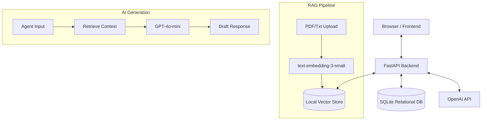

# 🤖 AI Customer Complaint Resolution Center (ComplaintIQ)


## 📖 Project Overview

The **AI Customer Complaint Resolution Center (ComplaintIQ)** is a comprehensive, full-stack business support platform designed to revolutionize how companies handle customer dissatisfaction. By leveraging advanced Retrieval-Augmented Generation (RAG) and OpenAI's cutting-edge models, this system transforms a stressful process into an opportunity for customer retention and operational improvement.

Instead of generic template responses, the AI assistant analyzes the sentiment and specifics of each complaint, cross-references it with internal knowledge bases and previous successful resolutions, and drafts highly personalized, empathetic, and context-accurate responses. It empowers customer support agents to work faster and smarter.

## ✨ Features

### 🎯 Complaint Management
- Centralized inbox for all incoming complaints
- Automatic categorization, priority assignment, and sentiment analysis
- Status tracking from open to resolved

### 🤖 AI Classification & RAG
- AI-powered root cause analysis
- Context-aware response drafting using semantic search (text-embedding-3-small)
- Automatic extraction of key entities (product, order number, dates)

### 📊 Analytics & Insights
- Interactive dashboard visualizing complaint trends over time
- Sentiment distribution and categorization metrics
- Agent performance and resolution time tracking

### 📚 Knowledge Base
- Upload and manage company policies, manuals, and FAQs
- Automatic chunking and vectorization of documents
- Easy semantic retrieval for AI context generation

### 🔔 Escalation Management
- Automated triggers for high-severity or legally sensitive complaints
- Managerial override and approval workflows
- Multi-tier support escalation paths

### 📱 Multi-Channel Communication
- Simulated support for Email, SMS, and WhatsApp outputs
- Consistent brand voice across all channels

## 💻 Tech Stack

| Tier | Technologies |
|------|-------------|
| **Frontend** | HTML5, Tailwind CSS, Vanilla JavaScript, Chart.js |
| **Backend** | Python 3.11+, FastAPI, SQLAlchemy, Pydantic |
| **Database** | SQLite (dev) / PostgreSQL (prod), FAISS / ChromaDB (Vectors) |
| **AI/ML** | OpenAI GPT-4o-mini, text-embedding-3-small |

## 📸 Screenshots

*Screenshots coming soon...*

## 🏗️ Architecture



## 🚀 Getting Started

### Prerequisites
- Python 3.11 or higher
- Node.js (optional, for frontend live server)
- OpenAI API Key

### Installation

1. **Clone the repository:**
   ```bash
   git clone https://github.com/yourusername/complaint-iq.git
   cd complaint-iq
   ```

2. **Backend Setup:**
   ```bash
   cd backend
   python -m venv venv
   source venv/bin/activate  # On Windows: venv\Scripts\activate
   pip install -r requirements.txt
   ```

3. **Environment Variables:**
   Create a `.env` file in the `backend` directory:
   ```env
   OPENAI_API_KEY=your_openai_api_key_here
   DATABASE_URL=sqlite:///./complaint_center.db
   SECRET_KEY=your_super_secret_key
   DEBUG=True
   ```

4. **Run the Backend:**
   ```bash
   uvicorn main:app --reload --port 8000
   ```

5. **Run the Frontend:**
   Open a new terminal, navigate to the project root, and serve the frontend:
   ```bash
   cd frontend
   python -m http.server 5500
   ```
   Navigate to `http://localhost:5500` in your browser.

## ⚙️ Configuration

The following environment variables are supported in `.env`:

- `OPENAI_API_KEY`: **(Required)** Your OpenAI API key for LLM and embeddings.
- `DATABASE_URL`: Connection string for the database (default: `sqlite:///./complaint_center.db`).
- `SECRET_KEY`: Used for session management and basic auth.
- `CHUNK_SIZE`: Token size for RAG document chunking (default: 500).
- `CHUNK_OVERLAP`: Overlap tokens for RAG (default: 50).

## 📚 API Documentation

Once the backend is running, full interactive API documentation is available at:
- **Swagger UI**: [http://localhost:8000/docs](http://localhost:8000/docs)
- **ReDoc**: [http://localhost:8000/redoc](http://localhost:8000/redoc)

## 📁 Project Structure

```text
E:\AI Customer Complaint Resolution Center\
├── backend/
│   ├── main.py              # FastAPI application entry point
│   ├── api/                 # API routers
│   ├── core/                # Config, security, database setup
│   ├── models/              # SQLAlchemy database models
│   ├── schemas/             # Pydantic models for validation
│   ├── services/            # Business logic and AI integration
│   ├── uploads/             # Knowledge base document storage
│   └── requirements.txt
├── frontend/
│   ├── index.html           # Dashboard
│   ├── complaints.html      # Complaint list
│   ├── view-complaint.html  # Detail view with AI integration
│   ├── knowledge.html       # KB management
│   ├── analytics.html       # Charts and reporting
│   ├── css/                 # Tailwind + custom CSS
│   ├── js/                  # Vanilla JS API clients
│   └── assets/              # Images, icons
├── docs/                    # Detailed documentation
├── .env.example             # Example environment file
├── .gitignore
├── README.md
├── LICENSE
└── CONTRIBUTING.md
```

## 🤝 Contributing
Please see our [CONTRIBUTING.md](CONTRIBUTING.md) for details on our code of conduct, and the process for submitting pull requests to us.

## 📄 License
This project is licensed under the MIT License - see the [LICENSE](LICENSE) file for details.

## ✉️ Author / Contact
Created by the AI Assistant Team. For inquiries, please open an issue on the repository.
